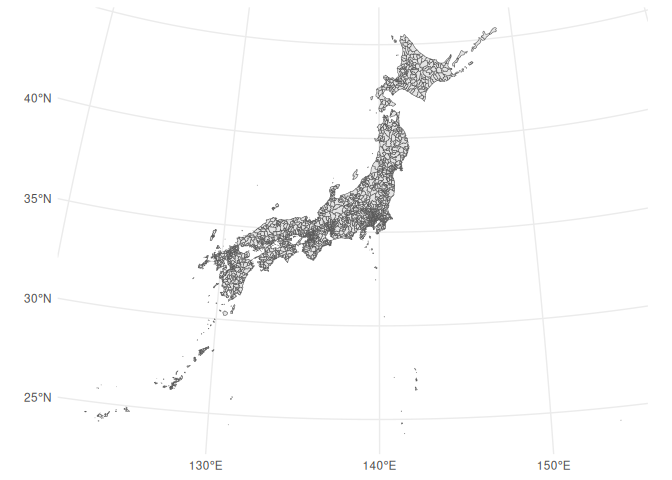
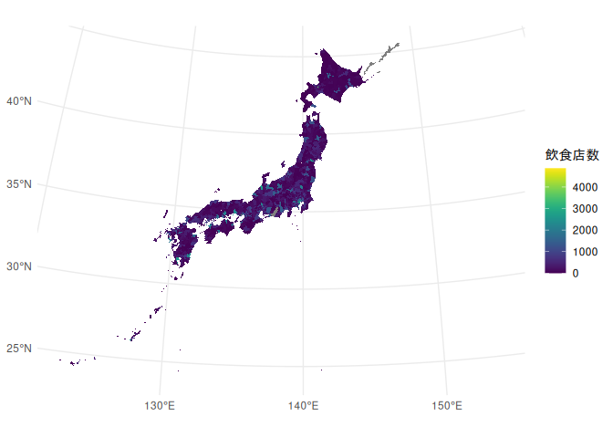
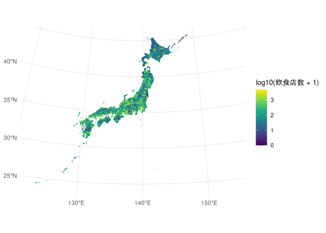
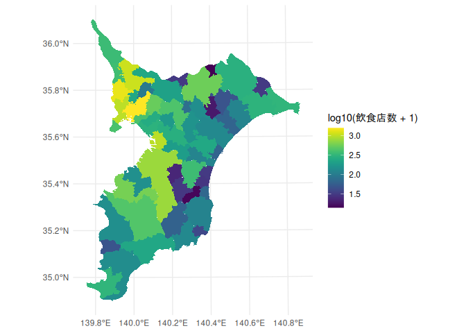

Tutorial 市区町村データを地図上に可視化する
================
Takaaki Aoki
2024-10-28

# 行政区域ポリゴンデータを国土数値情報ダウンロードサイトから取得する

ここでは2024年版を使います。
<https://nlftp.mlit.go.jp/ksj/gml/datalist/KsjTmplt-N03-2024.html>

2024年（令和6年）1月1日時点の行政区画データです。

- 全国(世界測地系)のデータ(filename =
  N03-20240101_GML.zip)を取得し、`downloaded`におきます。
- データを解凍

<!-- -->

    unzip downloaded/N03-20240101_GML.zip -d downloaded -o

# Library `sf`の読み込み

``` r
library(sf)
```

    ## Linking to GEOS 3.12.2, GDAL 3.9.2, PROJ 9.4.1; sf_use_s2() is TRUE

# 行政区域ポリゴンデータを読み込む

``` r
municipalities_polygon = st_read("downloaded/N03-20240101.shp")
```

    ## Reading layer `N03-20240101' from data source 
    ##   `/home/aoki/Dropbox/00CurrentProject/Tutorial_plot_stat_jp_municipalities/downloaded/N03-20240101.shp' 
    ##   using driver `ESRI Shapefile'
    ## Simple feature collection with 124133 features and 6 fields
    ## Geometry type: POLYGON
    ## Dimension:     XY
    ## Bounding box:  xmin: 122.9326 ymin: 20.42275 xmax: 153.9867 ymax: 45.55724
    ## Geodetic CRS:  JGD2011

## 中身の確認

``` r
head(municipalities_polygon)
```

    ## Simple feature collection with 6 features and 6 fields
    ## Geometry type: POLYGON
    ## Dimension:     XY
    ## Bounding box:  xmin: 140.9905 ymin: 42.78071 xmax: 141.4735 ymax: 43.18951
    ## Geodetic CRS:  JGD2011
    ##   N03_001    N03_002 N03_003 N03_004 N03_005 N03_007
    ## 1  北海道 石狩振興局    <NA>  札幌市  中央区   01101
    ## 2  北海道 石狩振興局    <NA>  札幌市    北区   01102
    ## 3  北海道 石狩振興局    <NA>  札幌市    東区   01103
    ## 4  北海道 石狩振興局    <NA>  札幌市  白石区   01104
    ## 5  北海道 石狩振興局    <NA>  札幌市  豊平区   01105
    ## 6  北海道 石狩振興局    <NA>  札幌市    南区   01106
    ##                         geometry
    ## 1 POLYGON ((141.2569 42.99782...
    ## 2 POLYGON ((141.3333 43.07505...
    ## 3 POLYGON ((141.3734 43.0684,...
    ## 4 POLYGON ((141.382 43.04832,...
    ## 5 POLYGON ((141.3637 42.94154...
    ## 6 POLYGON ((141.2354 42.82273...

``` r
summary(municipalities_polygon)
```

    ##    N03_001            N03_002            N03_003            N03_004         
    ##  Length:124133      Length:124133      Length:124133      Length:124133     
    ##  Class :character   Class :character   Class :character   Class :character  
    ##  Mode  :character   Mode  :character   Mode  :character   Mode  :character  
    ##    N03_005            N03_007                   geometry     
    ##  Length:124133      Length:124133      POLYGON      :124133  
    ##  Class :character   Class :character   epsg:6668    :     0  
    ##  Mode  :character   Mode  :character   +proj=long...:     0

## 列名を修正. (N03_007 to jiscode)

``` r
municipalities_polygon = municipalities_polygon %>% rename(jiscode = N03_007)
```

## 市区町村毎にPolygonを集約

明らかに市区町村数よりもデータ数が多い

``` r
nrow(municipalities_polygon)
```

    ## [1] 124133

島しょ部が別々のレコードになっている

``` r
municipalities_polygon %>% filter(jiscode == "13421")
```

    ## Simple feature collection with 4812 features and 6 fields
    ## Geometry type: POLYGON
    ## Dimension:     XY
    ## Bounding box:  xmin: 136.0695 ymin: 20.42275 xmax: 153.9867 ymax: 27.7449
    ## Geodetic CRS:  JGD2011
    ## First 10 features:
    ##    N03_001 N03_002 N03_003  N03_004 N03_005 jiscode
    ## 1   東京都    <NA>    <NA> 小笠原村    <NA>   13421
    ## 2   東京都    <NA>    <NA> 小笠原村    <NA>   13421
    ## 3   東京都    <NA>    <NA> 小笠原村    <NA>   13421
    ## 4   東京都    <NA>    <NA> 小笠原村    <NA>   13421
    ## 5   東京都    <NA>    <NA> 小笠原村    <NA>   13421
    ## 6   東京都    <NA>    <NA> 小笠原村    <NA>   13421
    ## 7   東京都    <NA>    <NA> 小笠原村    <NA>   13421
    ## 8   東京都    <NA>    <NA> 小笠原村    <NA>   13421
    ## 9   東京都    <NA>    <NA> 小笠原村    <NA>   13421
    ## 10  東京都    <NA>    <NA> 小笠原村    <NA>   13421
    ##                          geometry
    ## 1  POLYGON ((141.2934 24.74985...
    ## 2  POLYGON ((142.2082 27.08417...
    ## 3  POLYGON ((142.1245 26.70517...
    ## 4  POLYGON ((142.1904 27.12066...
    ## 5  POLYGON ((141.2747 25.42231...
    ## 6  POLYGON ((142.2019 27.16627...
    ## 7  POLYGON ((141.4572 24.22508...
    ## 8  POLYGON ((140.8875 27.2499,...
    ## 9  POLYGON ((142.1243 27.68335...
    ## 10 POLYGON ((153.9733 24.2841,...

``` r
municipalities_polygon %>% filter(is.na(jiscode)) # Check if there are some records with jiscode == NA
```

    ## Simple feature collection with 0 features and 6 fields
    ## Bounding box:  xmin: NA ymin: NA xmax: NA ymax: NA
    ## Geodetic CRS:  JGD2011
    ## [1] N03_001  N03_002  N03_003  N03_004  N03_005  jiscode  geometry
    ## <0 rows> (or 0-length row.names)

市区町村毎にPolygonを集約(combine version)。

Reference : <https://r-spatial.github.io/sf/reference/geos_combine.html>

``` r
municipalities_polygon_combined = municipalities_polygon  %>% 
  group_by(jiscode) %>% 
  summarise(across(geometry, ~ sf::st_combine(.)), .groups = "drop")
```

市区町村毎にPolygonを集約(union
version)。内部境界を残したくない場合、union処理をする。ただし実行時間がかかる

``` r
municipalities_polygon_unioned = municipalities_polygon  %>% 
  group_by(jiscode) %>% 
  summarise(across(geometry, ~ sf::st_union(.)), .groups = "drop")
```

# 座標参照システム（CRS）の確認

Reference:

- <https://en.wikipedia.org/wiki/Spatial_reference_system>
- 空間参照系 <https://www.mlit.go.jp/plateau/learning/tpc03-4/>
- あさひコラム座標参照系（CRS）とは？
  <https://www.aeroasahi.co.jp/fun/column/19/>
- 【GIS基礎知識】座標参照系（CRS）について詳しく解説します！
  <https://sinrintech.com/knowledge/gis/crs/>

``` r
st_crs(municipalities_polygon)
```

    ## Coordinate Reference System:
    ##   User input: JGD2011 
    ##   wkt:
    ## GEOGCRS["JGD2011",
    ##     DATUM["Japanese Geodetic Datum 2011",
    ##         ELLIPSOID["GRS 1980",6378137,298.257222101,
    ##             LENGTHUNIT["metre",1]]],
    ##     PRIMEM["Greenwich",0,
    ##         ANGLEUNIT["degree",0.0174532925199433]],
    ##     CS[ellipsoidal,2],
    ##         AXIS["geodetic latitude (Lat)",north,
    ##             ORDER[1],
    ##             ANGLEUNIT["degree",0.0174532925199433]],
    ##         AXIS["geodetic longitude (Lon)",east,
    ##             ORDER[2],
    ##             ANGLEUNIT["degree",0.0174532925199433]],
    ##     USAGE[
    ##         SCOPE["Horizontal component of 3D system."],
    ##         AREA["Japan - onshore and offshore."],
    ##         BBOX[17.09,122.38,46.05,157.65]],
    ##     ID["EPSG",6668]]

## 座標参照システム（CRS）の変換

WGS84から日本測地系2011における平面直角座標系に変換する。
ここでは関東圏を中心に、平面直角座標9系(EPSGコード 6677)に変換します。
<https://epsg.io/6677>

``` r
municipalities_polygon_projected =  st_transform(municipalities_polygon_unioned, crs= 6677)
```

# データを簡略化する

## データサイズの確認

``` r
print(object.size(municipalities_polygon_projected), units="Mb")
```

    ## 269.2 Mb

## `st_simplify`でデータサイズを削減する

Reference:

- <https://r-spatial.github.io/sf/reference/geos_unary.html>
- <https://postgis.net/docs/manual-dev/ja/TP_ST_Simplify.html>
- <https://gis.stackexchange.com/questions/11910/meaning-of-simplifys-tolerance-parameter>

dTolerance parameter(単位はmeter)を調整し、Polygonデータを簡素化します。

``` r
municipalities_polygon_simplified = st_simplify(municipalities_polygon_projected, dTolerance = 100) # 100 meter
```

``` r
print(object.size(municipalities_polygon_simplified), units="Mb")
```

    ## 6.1 Mb

# 白地図をPlotする

## library `ggplot2`の読み込み

``` r
library(ggplot2)
```

## 白地図をPlot

``` r
ggplot(data = municipalities_polygon_simplified) + geom_sf() + theme_minimal()
```

<!-- -->

# 統計でみる市区町村のすがたのデータ を結合する

<https://www.stat.go.jp/data/s-sugata/index.html>

## データを取得する

[基礎データ from the Portal Site of Official Statistics of Japan
(e-Stat).](https://www.e-stat.go.jp/stat-search/files?page=1&layout=datalist&toukei=00200502&tstat=000001218560&cycle=0&tclass1=000001218561&cycle_facet=cycle&tclass2val=0&metadata=1&data=1)

ここでは居住(表番号 H)を取得し、`downloaded`におきます。

## `readxl` libraryの読み込み

``` r
library(readxl)
```

## Excelfileの読み込み

``` r
headers = read_excel("downloaded/2024-h.xls", na="...", range = "I6:W6", col_names = F ) # Extract one row as header
```

    ## New names:
    ## • `` -> `...1`
    ## • `` -> `...2`
    ## • `` -> `...3`
    ## • `` -> `...4`
    ## • `` -> `...5`
    ## • `` -> `...6`
    ## • `` -> `...7`
    ## • `` -> `...8`
    ## • `` -> `...9`
    ## • `` -> `...10`
    ## • `` -> `...11`
    ## • `` -> `...12`
    ## • `` -> `...13`
    ## • `` -> `...14`
    ## • `` -> `...15`

``` r
headers = unname(unlist(headers[1,])) # covert as unnamed vector
headers  = str_replace_all(headers,  "[\r\n]" , "") # remove line breaks
headers
```

    ##  [1] "市区町村"               "Municipalities"         "居住世帯あり住宅数"    
    ##  [4] "持ち家数"               "借家数"                 "１住宅当たり延べ面積"  
    ##  [7] "非水洗化人口"           "ごみ計画収集人口"       "ごみ総排出量"          
    ## [10] "ごみのリサイクル率"     "小売店数"               "飲食店数"              
    ## [13] "大型小売店数"           "百貨店、総合スーパー数" "市区町村ｺｰﾄﾞ"

``` r
table_h= read_excel("downloaded/2024-h.xls", na="...", range = cell_limits(c(11, 9), c(NA, NA)), col_names = headers ) # upper left = I11, everything else unspecified
```

## 列名変更

``` r
table_h = table_h %>% rename(jiscode = '市区町村ｺｰﾄﾞ')
```

## 市区町村ポリゴンデータに対して、居住データ(表番号 H)を結合する

Reference:
<https://dtplyr.tidyverse.org/reference/left_join.dtplyr_step.html>

市区町村ポリゴンデータの全件を残しつつ、対応する居住データ(表番号
H)を紐づける(jiscodeが一致)。

``` r
municipalities_with_table_h = municipalities_polygon_simplified %>% left_join(table_h)
```

    ## Joining with `by = join_by(jiscode)`

# 地図上への可視化

``` r
summary(municipalities_with_table_h)
```

    ##    jiscode                   geometry      市区町村         Municipalities    
    ##  Length:1905        MULTIPOLYGON : 464   Length:1905        Length:1905       
    ##  Class :character   POLYGON      :1441   Class :character   Class :character  
    ##  Mode  :character   epsg:6677    :   0   Mode  :character   Mode  :character  
    ##                     +proj=tmer...:   0                                        
    ##                                                                               
    ##                                                                               
    ##                                                                               
    ##  居住世帯あり住宅数    持ち家数          借家数       １住宅当たり延べ面積
    ##  Min.   :  1460     Min.   :   700   Min.   :   100   Min.   : 42.54      
    ##  1st Qu.: 11190     1st Qu.:  8540   1st Qu.:  2290   1st Qu.: 90.39      
    ##  Median : 22235     Median : 15760   Median :  5520   Median :105.44      
    ##  Mean   : 41903     Mean   : 25401   Mean   : 15111   Mean   :107.15      
    ##  3rd Qu.: 54545     3rd Qu.: 32405   3rd Qu.: 18558   3rd Qu.:122.02      
    ##  Max.   :466530     Max.   :199820   Max.   :229580   Max.   :204.24      
    ##  NA's   :671        NA's   :671      NA's   :671      NA's   :671         
    ##   非水洗化人口   ごみ計画収集人口  ごみ総排出量    ごみのリサイクル率
    ##  Min.   :    0   Min.   :   171   Min.   :    65   Min.   :  0.00    
    ##  1st Qu.:  360   1st Qu.:  7552   1st Qu.:  2353   1st Qu.: 12.80    
    ##  Median : 1230   Median : 22552   Median :  7432   Median : 18.05    
    ##  Mean   : 2895   Mean   : 57219   Mean   : 17087   Mean   : 20.54    
    ##  3rd Qu.: 3285   3rd Qu.: 60452   3rd Qu.: 19128   3rd Qu.: 24.40    
    ##  Max.   :53032   Max.   :917932   Max.   :203347   Max.   :100.00    
    ##  NA's   :184     NA's   :184      NA's   :207      NA's   :207       
    ##     小売店数       飲食店数       大型小売店数     百貨店、総合スーパー数
    ##  Min.   :   0   Min.   :   0.0   Min.   :  0.000   Min.   : 0.000        
    ##  1st Qu.:  76   1st Qu.:  28.0   1st Qu.:  0.000   1st Qu.: 0.000        
    ##  Median : 225   Median :  92.0   Median :  3.000   Median : 0.000        
    ##  Mean   : 459   Mean   : 261.1   Mean   :  9.679   Mean   : 0.577        
    ##  3rd Qu.: 558   3rd Qu.: 283.0   3rd Qu.: 12.000   3rd Qu.: 1.000        
    ##  Max.   :4876   Max.   :4868.0   Max.   :126.000   Max.   :14.000        
    ##  NA's   :16     NA's   :16       NA's   :16        NA's   :16

``` r
library(viridis) # for color palette
```

    ## Loading required package: viridisLite

``` r
ggplot(data = municipalities_with_table_h) + geom_sf(aes(fill = `飲食店数`), color="gray",linewidth=0.001) +
  scale_fill_viridis() +  theme_minimal()
```

<!-- -->

``` r
library(viridis) # for color palette
ggplot(data = municipalities_with_table_h) + geom_sf(aes(fill = log10( `飲食店数` + 1)) , color="gray",linewidth=0.001) +
  scale_fill_viridis() +  theme_minimal()
```

<!-- -->

## 特定地域のみの取り出し

``` r
ggplot(data = municipalities_with_table_h %>% filter(str_starts(jiscode,"12"))) + # 12XXXX (千葉県)
  geom_sf(aes(fill = log10( `飲食店数` + 1)) , color="gray",linewidth=0.001) +
  scale_fill_viridis() +  theme_minimal()
```

<!-- -->
